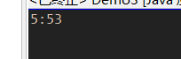

#task0003
##完成情况
###截图
*每张图为一个demo的截图

*demo1 
 
*demo2 
 
*demo3 
 
*demo4 
 

###由于地区问题所以显示出来的有的是中文，并没与展示出来示例中简写和全拼的差异
##总结
>本次练习了date和calendar类的相关内容，并通过format类学习了国际化的相关知识，在阅读api时发现SimpleDateFormate和format的内容其实挺复杂的涉及到了许多内容，如果要熟练应用需要记忆相应字段